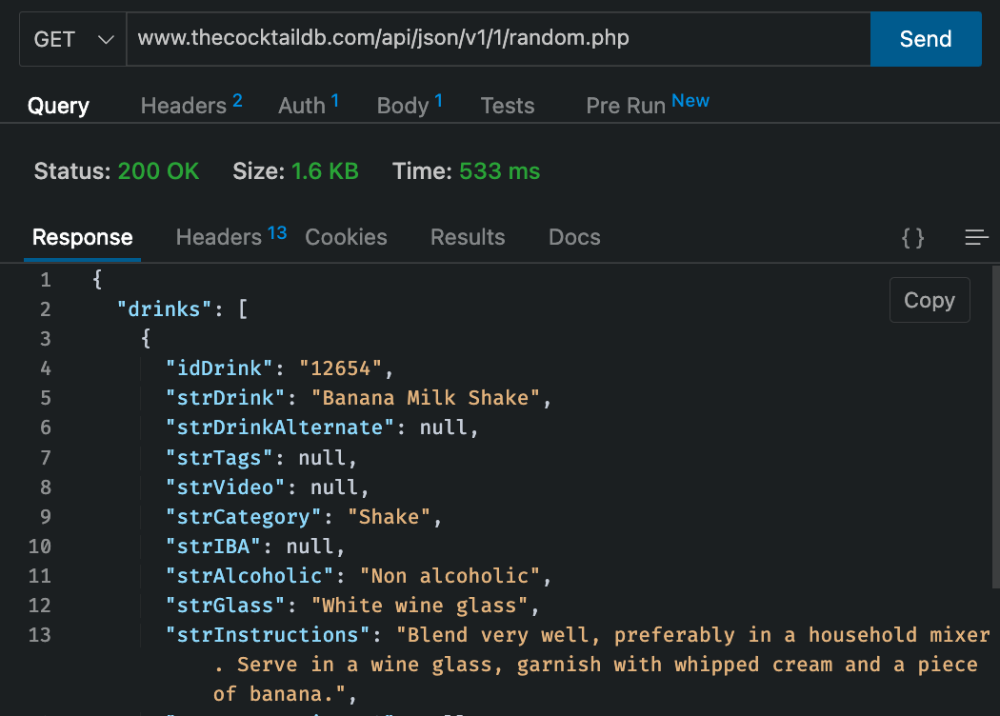
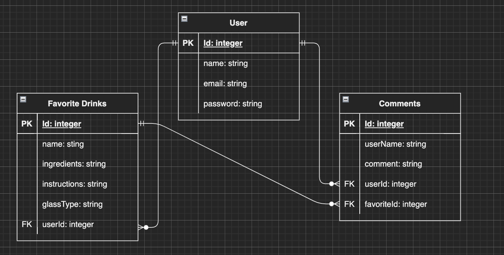
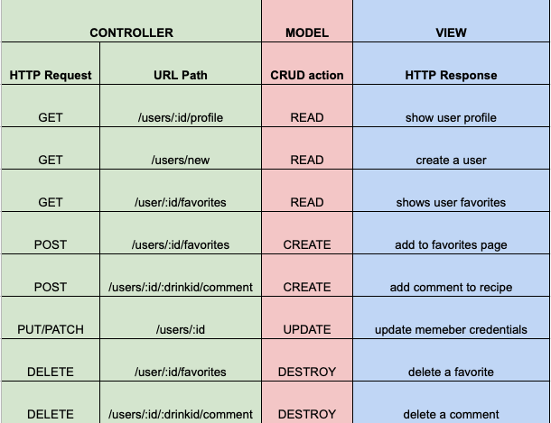
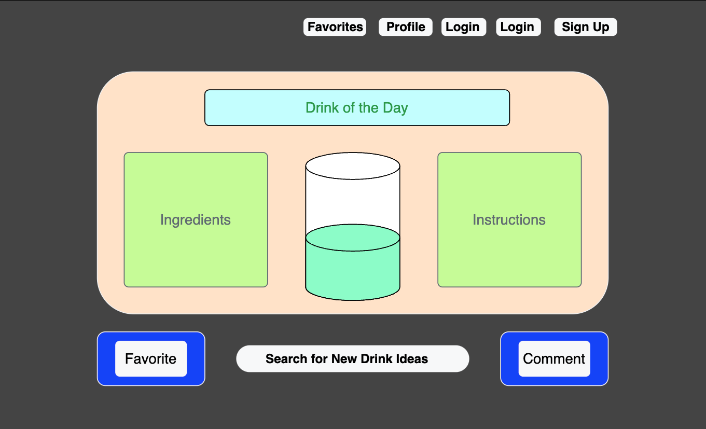
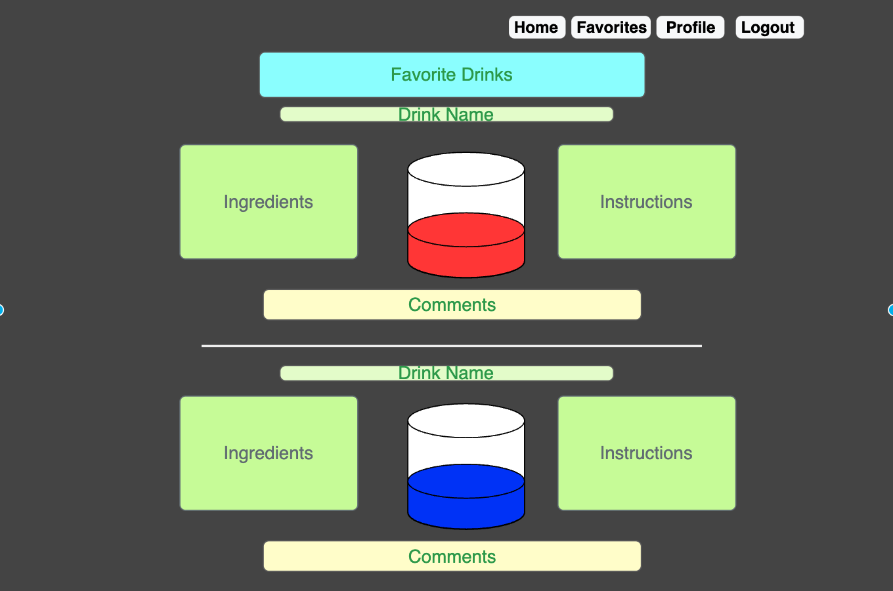
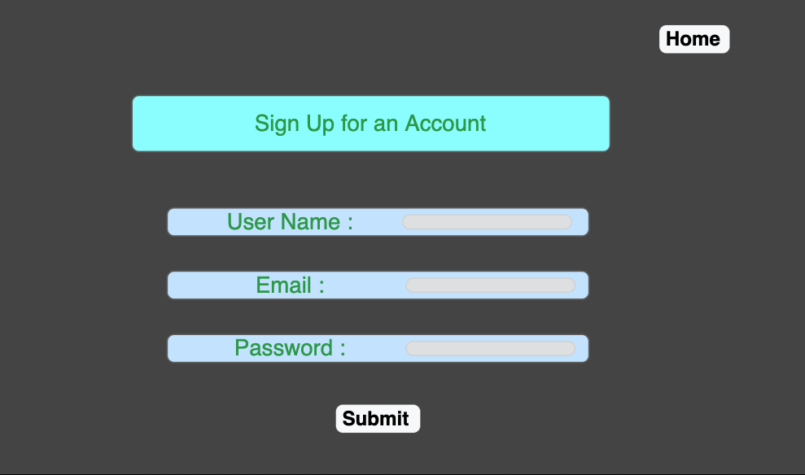
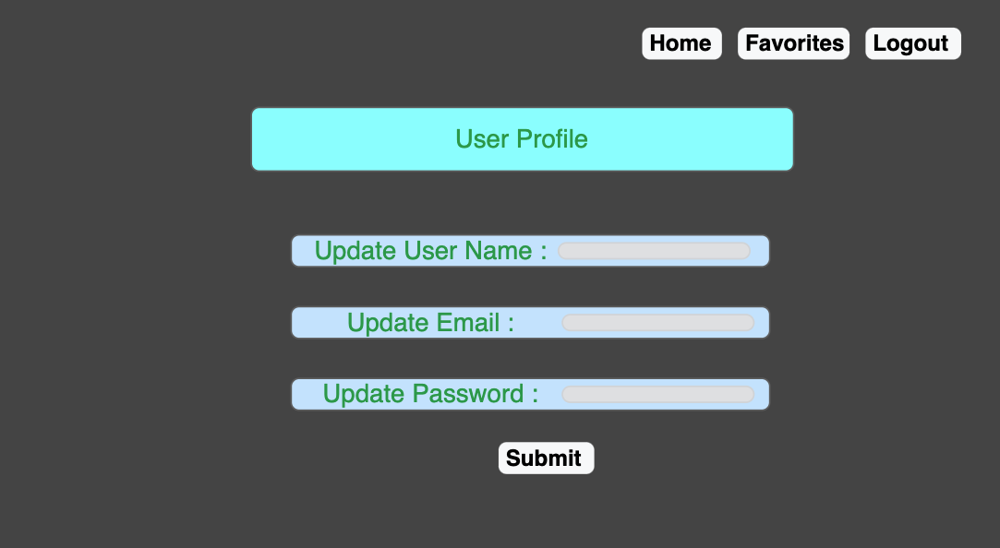

# DrinkTales

Dont know what to drink? Wondering what other people think of a a drink? Your in the right place!

DrinkTales is an app were you can find new drinks, favorite and comment on drinks you find in the app.
Want to try a new twist on your favorite alcohol, or have an ingredient you love but want to find new recipies to use it in? 
Pop your ingredient in the search bar and see what you find!

# See the App by Following the Link Below

* https://drinktales-app.herokuapp.com/favorites

# About the App

DrinkTales will be a social drink recipe app where you can search for ingredients and get new cocktail recipies to make for yourself. You will be able to add recipies to your favorites page so they are stored for you anytime you want to pull them up again. You can leave comments on each cocktail recipe and see what what other people have to say about the recipe. 

# Installation Instructions

Fork and Clone the repo to your local repository
Run npm init -y to initialize npm in the terminal
Open the package.json file and confirm the npm packages listed under dependencies
In the terminal run npm install or npm i to download all required npm packages. 
Make sure node_modules and .env folder are showing the gitignore files before committing to repository
Run sequelize db:create in the terminal to create the database in psql
Run sequelize db:migrate in the terminal to migrate the models
Ensure the correct assosiations in the models 
Use the nodemon command in the terminal to start your application locally
Go to http://localhost:8000/ in your browser to see the app and track your changes

# API Selected

* https://www.thecocktaildb.com/api.php

# Tech Used

* HTML
* Bootstrap
* CSS
* Javascript
* Express
* EJS
* Axios
* Postgres
* Sequelize
* Dovenv
* Cookie Parser
* Crypto-JS

# ERD 

# Restful Routing Chart

# Wireframes

# User Stories

As a user I would like to use this app to find new drink recipies. I would like to know what ingedients to use in the drink and instructions on how to make the drink. I would like to be able to favorite drinks I really like so I can see them later on. I also would like to add a comment on a recipe and see comments other people have on recipies.

# MVP 

* Homescreen diplays a random cocktail with the ingredients list and instuctions for making the cocktail
* Search bar or bars that allow you to search the API by drink name or ingredient 
* Sign up page that allows you to create an account,and gives you the ability to comment on and favorite recipies 
* Update account page that allows you to update your user credentials
* Favorites Page that shows all favorite recipes, gives the option to delete a favorite, and shows all comments on the recipe

# Stretch Goals

* Render an Image of the drink to the screen
* Ability to like another persons quotes
* Add a Chuck Norris API to show Chuck Norris quotes if you click a button under a cocktail recipe
* Add a Dad Jokes API to show a dad joke if you click a button under a cocktail recipe
* Add a Quotes API to show a quote if you click a button under a cocktail recipe

# Approach Taken

When starting to plan this app I thought is would be a good canidate for a mobile first application. I started my planning to get an understanding of all the needed elements and routes and then begain code it out step by step. 

I started by andding the database models and assosiations first then tested to make sure I was able to add information to thosse models correctly. After testing my CRUD functionality on the database I create a very basic bootstrap format for the app complete to view the changes as I coded.

I then worked to pull a random drink from the the API and show that information on the home screen. Once this was working to proceeded to add the form and inputs needed to create the route to add the random drink to the favorites database. After confirming the drink was added to the favorites model I created an new view to pull the favorited drinks from the database to show on the screen. I created a for each loop to show all favorited drinks. 

With the ability to now create a new favorite in the database and see a page of the favorites I began to takle how to add comments to the favorited drinks. I originaly had all comments on the favorited drink but after finishing adding the comments to the favorties view I didnt like how the information was displayed so I decieded to create a details view to keep my favorites view looking clean and uniform. I then created the details view to show the instructions and ingredents needed to make the selected drink. 

With most of the project now in a working state I focused on ading the search functionality to the search bar in the Navbar. Once the search results route and view were complete I used the existing details view to allow the user to view the details of the selected drink from the search results. I then added the final remaining CRUD operation of update by allowing the user to update there password. With MVP complete I focused on testing, debug, reformating, and cleaning up my code. 

# Post-Project Reflection 

I grew a lot from this project. In the begining I was very unsure of my ability to complete this project to a standard I would be happy with. I did take a few days completely away from this project during the break so I could focus on my family and getting recharged but was very surprised when I got back to working on this that I really did understand what to do and why to do it and was even able to help others with some of the problems they were having. 

One ah-ha moment I had was using the testdb.js file as I found it very useful to be able to code and test outside of the structure of the existing code. It was then very clear what needed to happen inside the existing code because I had ensured what I was doing worked before adding to the app. This project also cemented for me that when coding I need to works systematically fixing one small problem or feature at a time. 

The main unsolved problem I have is when selecting a drink from the search result to view its details the comments show if a drink is favorited in the databse by any user insead of a favorite button as that specific user has not favorite that drink yet and should not be able to comment on it without favoriting. I allow would like to fix how the footer is not set to the bottom of the screen in all views. 

# Sources Used

Past lessons, and labs.